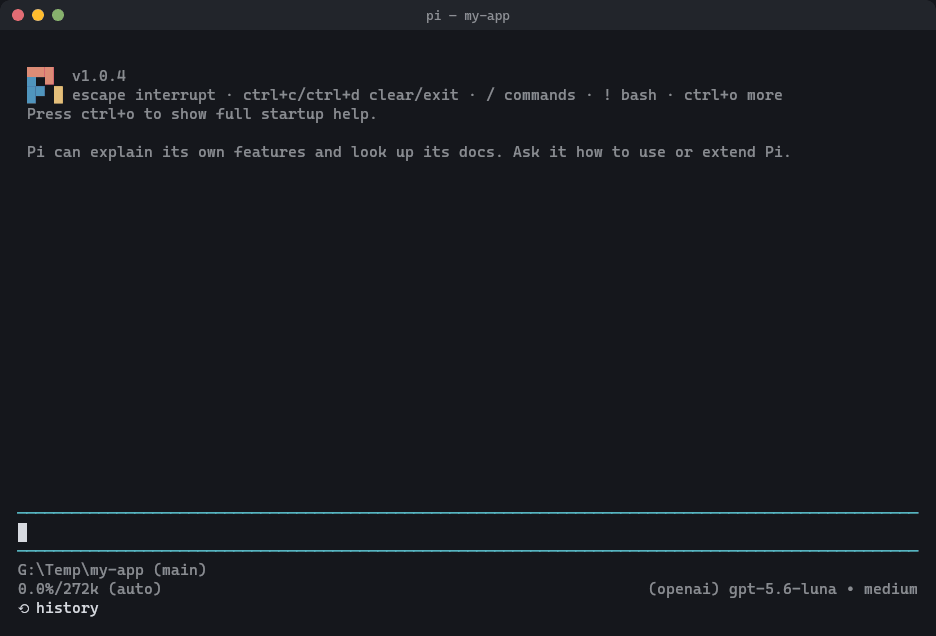

# pi-workspace-history

[English version](./README.md)

[Pi 编码代理](https://pi.dev) 的撤销功能。Agent 改坏了东西，输入 `/undo`，文件和对话一起回到这条提示词之前，一步到位。



## 快速上手

```bash
pi install npm:pi-workspace-history       # 所有项目可用
pi install -l npm:pi-workspace-history    # 只装到当前项目（.pi/settings.json）
pi -e npm:pi-workspace-history            # 不安装，只在本次运行中试用
```

在项目目录里启动 `pi`，底栏出现 `⟲ history` 就表示已生效。照常使用 Pi，Agent 改坏了就输入 `/undo`。

要求：Pi 0.84.4 或更高（已在 0.84.4、1.0.4 和 1.1.0 上测试）、Node.js 22.19.0 或更高，并且 `PATH` 中有 `git`。项目本身不必是 Git 仓库。

## 命令

| 命令 | 作用 |
|---|---|
| `/undo` | 回到上一次 Agent 操作之前：文件和对话一起（或只回退对话），并把原提示词放回输入框 |
| `/redo` | 把 `/undo` 刚撤掉的内容恢复回来 |
| `/tree` / 双击 Esc | 跳到对话中的任意位置，并选择文件是否一起恢复 |
| `/diff [n]` | 查看最近一次 Agent 操作改了什么（`/diff 2` 看再前一次） |
| `/checkpoint [label]` | 保存当前文件，比如手动修改之前 |
| `/history-status` | 查看历史功能是否生效、存储位置、被跳过的文件和最近的错误 |

`/undo` 只问一个问题（文件和对话一起，还是只回退对话），其余自动完成，`/redo` 沿用同一个选择。`/diff` 是单独的只读命令，查看改动不会给撤销多加一步。

## 撤销能覆盖什么

- **整次操作。** 从你发出提示词到 Agent 结束，算作一个单位：所有工具轮次、自动重试、上下文压缩，以及运行中你追加的消息。一次 `/undo` 全部撤掉。
- **所有文件改动。** Agent 修改、新建、删除、重命名的文件，包括通过 Shell 命令做的改动。
- **你自己的修改不会丢。** 两次提示词之间的手动修改，会在下一条提示词发出前保存。如果工作区里有还没保存进历史的修改，恢复文件的操作会被拒绝，而不是覆盖它们。可以先用 `/checkpoint` 保存，或者选择"只回退对话"。
- **不碰你的仓库。** 历史保存在项目外的一个私有 Git 仓库里。你的提交、分支、暂存区、stash、refs 以及 Jujutsu 的操作记录都不会被改动；撤销只恢复文件内容，所以 `git status` 会把恢复的文件显示为修改。

不会处理的内容：

- 被你的 `.gitignore` 忽略的路径，以及下面这些路径，它们永远不会被保存或覆盖：`.git/`、`.jj/`、`node_modules/`、`dist/`、`build/`、`.cache/`、`.next/`、`.turbo/`、`coverage/`、`.env`、`.env.*`、`.pi/workspace-history/`。即使 `.gitignore` 写了 `!.env.local` 这样的反向规则，也不会把它们加回来。
- 超过 10 MB 的新文件。会提示一次，撤销和重做都不会动它们。已经在历史中的文件不受大小限制。
- 嵌套的 Git 仓库（包括 worktree）。每个只提示一次；要管理它的历史，请在那个仓库里打开 Pi。
- 文件权限。在 Linux 和 macOS 上，有可执行权限的文件恢复后仍然可执行；但只改权限的操作（例如 `chmod +x`）不会被撤销，恢复时重新创建的文件也没有可执行权限。
- 工作区以外的一切：部署、API 调用、数据库。

## 常见问题

**能只撤回对话、保留文件吗？**
可以。`/undo` 和 `/tree` 都提供"只回退对话（保留当前文件）"。当前文件会先被保存，之后仍然可以回到这个状态。

**撤销错了还能恢复吗？**
可以，用 `/redo`。

**和 Pi 自带的 `/tree` 有什么区别？**
Pi 自带的 `/tree` 只移动对话。装了本插件后，`/tree` 还能把文件恢复到所选位置对应的状态。如果那个位置的文件和现在一样，就不再询问。

**`/fork` 呢？**
`/fork` 会把对话复制到一个新会话，文件保持不变。新会话的历史从空开始：原会话里的操作在新会话中不能撤销，之后的新操作可以撤销。如果要把文件恢复到之前的某个位置，请在原会话里用 `/tree` 或 `/undo`。

**大仓库或 WSL 上会慢吗？**
发送提示词不会等待快照，详见[性能](#性能)。在 WSL 上，建议把项目放在 Linux 文件系统里，不要放在 `/mnt/c` 下。

**在我的目录里没有生效。**
运行 `/history-status`，它会说明原因。默认情况下，当前目录或上级目录里需要有项目标记，例如 `.git`、`.jj`、`package.json`、`Cargo.toml`、`go.mod`、`pyproject.toml`；在用户 home 目录，以及只是放了好几个仓库的文件夹里，插件不会启用。设置 `"workspaceHistory": { "enabled": true }` 可以强制启用。

**底栏显示 `snapshot failed`。**
有一次快照没能保存，之后的操作可能无法撤销。`/history-status` 会显示具体错误。等下一次操作被成功记录，这个提示就会消失。

## 配置

设置项放在 `~/.pi/agent/settings.json`（全局）或 `.pi/settings.json`（项目）的 `workspaceHistory` 下。在 Pi 1.x 上，只有信任了项目文件夹，项目设置才会生效，和 Pi 自己读取项目设置的规则一致。

```json
{
  "workspaceHistory": {
    "storageDir": "D:\\pi-history",
    "maxSessionsPerWorkspace": 3,
    "maxWorkspaces": 10
  }
}
```

| 设置项 | 默认值 | 说明 |
|---|---|---|
| `enabled` | `"auto"` | `"auto"` 在项目里启用（见上面的常见问题）；`true` 总是启用；`false` 关闭 |
| `requireProjectMarker` | `true` | 设为 `false` 时，`"auto"` 接受文件系统根目录和用户 home 目录以外的任意目录，并跳过多仓库文件夹的判断 |
| `allowHomeDirectory` | `false` | 允许在用户 home 目录启用 |
| `storageDir` | `~/.pi/agent/state/workspace-history` | 历史的存储位置。必须在工作区之外，否则插件会自动停用 |
| `maxSessionsPerWorkspace` | `3` | 每个工作区保留的会话数；超出时删除最久未用的非活跃会话 |
| `maxWorkspaces` | `10` | 总共保留的工作区数；超出时删除最久未用的非活跃工作区 |
| `maxUntrackedFileSizeMB` | `10` | 超过这个大小的新文件会被跳过；`0` 表示不限制 |
| `showStatus` | `true` | 在底栏显示 `⟲ history` |
| `gitTimeoutMs` | `60000` | 每条内部 Git 命令的超时时间；工作区特别大时可以调高 |
| `maxScanFiles`、`maxScanDirs`、`maxScanMs` | `20000`、`3000`、`5000` | 恢复时查找排除路径的扫描上限；超过上限时改用 Git 列出这些路径 |

下面这些 Pi 设置是可选的，能让历史导航更快捷：

```json
{
  "doubleEscapeAction": "tree",
  "treeFilterMode": "user-only"
}
```

`doubleEscapeAction: "tree"`（Pi 的默认值）让双击 Esc 打开 `/tree`。`treeFilterMode: "user-only"` 让 `/tree` 只列出你的提示词，选撤销点更快。

## 性能

测试条件：2000 个文件的工作区，每条提示词写一个文件：

| 环境 | 发送前的等待 | 每条提示词增加的耗时 |
|---|---|---|
| Windows 11 原生 | 2–5 ms | 约 0.5–1 秒 |
| WSL2，项目位于 `/mnt/g` | 约 12 ms | 约 3 秒 |

会话的第一条提示词需要等待初始快照，不过这个快照通常在你打字时就已在后台完成。在 Windows 11 上，2 万个文件的仓库建立初始快照约需 5 秒。复现方法：`npm run bench:first-turn -- 2000 256`。

在 Windows 11 上，`/undo` 和 `/redo` 在 2000 个文件的仓库里约需 0.7 秒，5000 个文件约 1 秒，2 万个文件约 1.5 秒。在 Linux 上（WSL2，项目位于 Linux 文件系统），2000 个文件约 0.1 秒，2 万个文件约 0.6 秒。

## 工作原理

每条提示词发出前，插件把工作区快照到这个会话专用的私有 Git 仓库；Agent 结束后再快照一次。每个快照都和对话树里的位置关联，所以 `/undo` 和 `/tree` 能恢复任意位置对应的文件。恢复时只写插件管理的文件，从不清理工作区里的其他内容。

- **发送不等待。** 从第二条提示词起，快照在模型思考时进行，Agent 的第一次工具调用会等它完成。如果快照失败，这次操作不会进入历史，错误会在这一轮结束时报告，底栏也会显示。
- **会话互相隔离。** 每个会话有自己的历史和重做状态，新会话不会撤销到旧会话的历史里。
- **只回退对话时**，会先保存当前文件，新的分支从这份文件继续。
- **Windows 上被占用的文件**会短暂重试。如果一直被占用，恢复会取消而不会跳过这个文件，待恢复的状态在重载后仍然保留；恢复失败后你做的修改不会被自动覆盖。
- **Git 超时。** 超过 `gitTimeoutMs` 的 Git 命令会被跟踪到它结束为止，期间这个工作区不会启动别的 Git 命令，避免两个写入者同时使用索引。来源不明的遗留 `index.lock` 会连同路径一起报告，绝不会被删除。
- **损坏的历史**会在使用前被发现。损坏的仓库会保留为 `repo.git.invalid-<timestamp>-<uuid>`，然后新建一个；只存在于损坏仓库里的快照可能无法使用。
- **快照提交从不签名**，保存历史不会要求解锁签名密钥。你的 Git 配置保持不变。

存储结构：

```text
~/.pi/agent/state/workspace-history/
  workspaces/
    <workspaceHash>/
      meta.json
      sessions/
        <sessionId>/
          active-session.json
          repo.git/
          redo.json
          meta.json
  logs/
    timemachine.log
```

运行中的会话持有租约，清理永远不会删除它们的历史。元数据读不出来的条目也会保留。

## 给 AI Agent 的安装说明

替用户安装时：

1. 检查前置条件：`node --version`（22.19.0 或更高）、`pi --version`（0.84.4 或更高）、`git --version`。
2. 运行 `pi install npm:pi-workspace-history`（只装到当前项目则用 `pi install -l npm:pi-workspace-history`）。
3. 重启 Pi 或运行 `/reload`。验证：底栏显示 `⟲ history`，且 `/history-status` 显示 `Workspace history: active`。如果显示 inactive，会同时给出原因；在没有项目标记的目录里，可在 `.pi/settings.json` 中设置 `"workspaceHistory": { "enabled": true }`。

纯文本摘要见 [`llms.txt`](./llms.txt)。

## 开发

```bash
npm ci
npm test
npm run typecheck
```

本仓库通过 `.pi/settings.json` 从 `.pi/extensions/workspace-history.ts` 加载扩展：在这里启动 `pi`，改动后运行 `/reload` 即可。要在别处安装本地代码，运行 `pi install /path/to/pi-workspace-history`。

开发使用 Pi 1.0.4 和 Node.js 22.19.0。CI 在 Linux 与 Windows 上，分别针对 Pi 1.0.4 和最低支持版本 0.84.4 运行。

版本变更见 [CHANGELOG.md](./CHANGELOG.md)。
